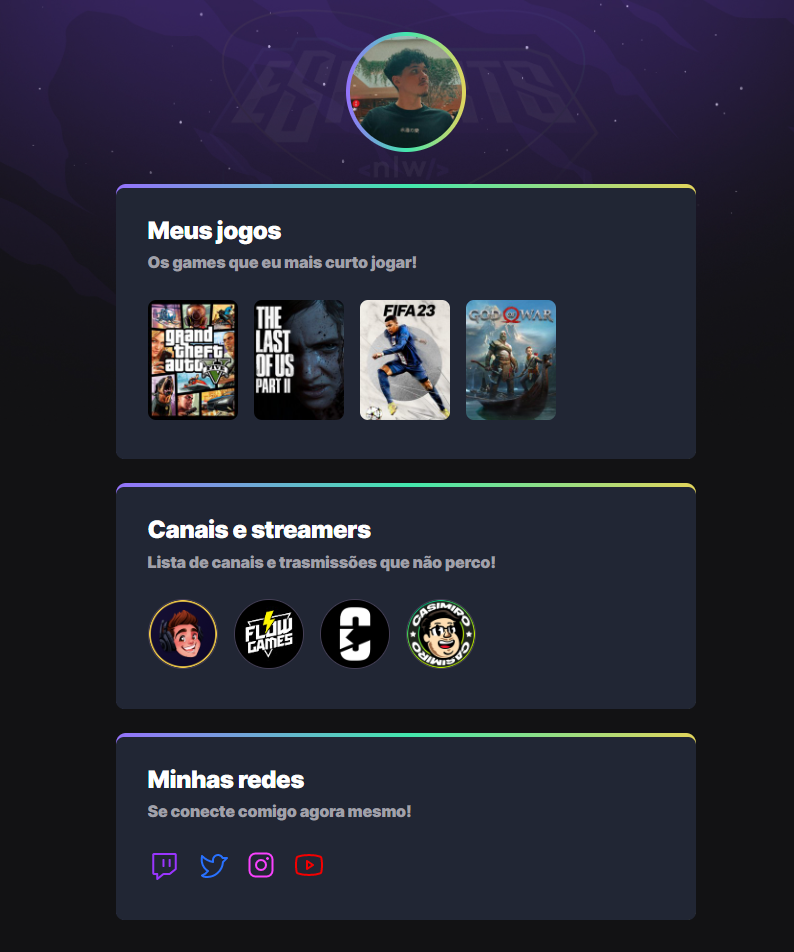

# 🎮 Perfil Gamer 

Projeto de página pessoal com temática gamer, desenvolvido para apresentar meus jogos favoritos, streamers que acompanho e minhas redes sociais. O objetivo foi criar uma interface interativa, responsiva e com visual moderno que represente minha identidade como gamer.

## 🧩 Funcionalidades

- 🎮 Seção com **meus jogos favoritos**
- 📺 Lista de **canais e streamers** que acompanho
- 🌐 Links para **redes sociais**
- 🎨 Estilo visual neon com **tema escuro**
- 💻 Design responsivo

## 🛠️ Tecnologias Utilizadas

- **HTML5**
- **CSS3**
- **JavaScript**

## 📸 Preview

## 🚀 Confira

1. Link: https://bryan01santos.github.io/NFL-eSports-explorer/
 
